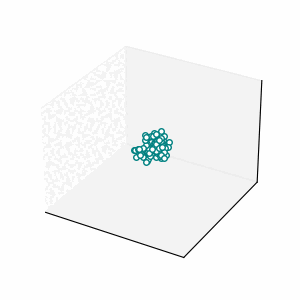

# FishSim

This is a collection of simulation code I wrote for my PhD project in the university of Bristol.




I implemented the following models for the collective behaviour.

- The voter model (JAP, MA, CH, HL, *PRE*, **2008**, [link to paper](https://journals.aps.org/pre/abstract/10.1103/PhysRevE.77.061138))
- The Vectorial Network Model (MA, CH, *J. Stat. Phys.*, **2003**, [link to paper](https://link.springer.com/article/10.1023/A:1023675519930))
- The Vicsek Model (TV, AC, EBJ, IC, OS, *PRL*, **1995**, [link to paper](https://journals.aps.org/prl/abstract/10.1103/PhysRevLett.75.1226))
- The Couzin Model (IDC, JK, GDR, NRF, *J. theor. Biol.*, **2002**, [link to paper](https://www.sciencedirect.com/science/article/pii/S0022519302930651))


## Use the module

1. Copy `lib/fish_sim` into your project folder.
2. Add the path to `lib` to `$PYTHONPATH`. (For instance, you can edit the `~/.bashrc` file.)

(Some examples are in the `tests` folder.)

## Dependency

The Python module requires the following packages: `numpy`, `matplotlib`, `scipy`, and `numba`.

They can be installed via command `python -m pip install numpy matplotlib scipy numba`

## \[Optional\] Fast Models

The following command will build an extra python package `cmodel`. It is written in C++, and binded by `pybind11`. The simulation of models in `cmodel` is faster, and the way to use these models is consistent with the Python models.

(You will need a C++ compiler and `CMake` to build the `cmodel` module.)

```sh
git submodule update --init  # download the Eigen & pybind11

mkdir build
cd build
cmake ..
make
make install
```

