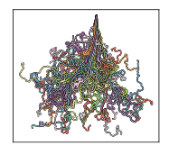

# FishSim

This is a collection of simulation code I wrote for my PhD project in the university of Bristol.
It is mosty written in C++ and packaged as python modules using [pybind11](https://github.com/pybind/pybind11).

It also has a twin project named [FishPy](https://github.com/yangyushi/FishPy).




## Dependency

You need to install [pybind11](https://github.com/pybind/pybind11) to build the source code.

## Install

the following command will build the package and run a test python script.

```sh
./build test
```

The test script will not be executed if `test` is not provided.

## Use the module

1. Copy `lib/cprofile.**.so` into your project folder
2. Use `import csimulate` as if it is a python module.